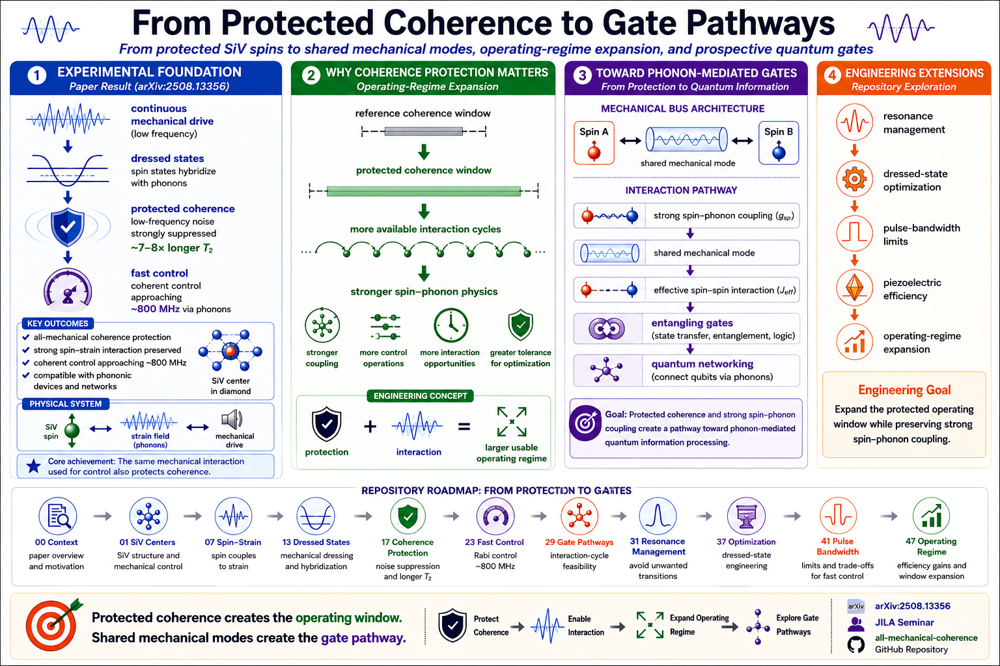

# All-Mechanical Coherence Protection and Fast Control of a Spin Qubit

Repository accompanying:

**arXiv:2508.13356**
*All-mechanical coherence protection and fast control of a spin qubit*

**Lab Report

<a href="labreports.app/2508-13356">Labreports.app lab report</a>

This project explores how continuous mechanical driving creates dressed states that protect spin coherence in SiV centers and how those protected operating regimes may support stronger spin–phonon interactions, shared mechanical modes, and future phonon-mediated gate pathways.



---

## Overview

The paper demonstrates that a continuously driven mechanical field can substantially increase coherence times while simultaneously enabling fast spin control.

The repository extends that result through a sequence of computational notebooks that explore:

* spin–strain coupling
* dressed-state engineering
* coherence protection
* resonance management
* operating-regime expansion
* spin–phonon interactions
* phonon-mediated gate pathways

The goal is not to reproduce the experiment in detail, but to build intuition for how coherence protection becomes an engineering resource for future quantum devices.

---

## Notebook Roadmap

| Notebook | Focus                                                   | Colab                                                                                                                                     |
| -------- | ------------------------------------------------------- | ----------------------------------------------------------------------------------------------------------------------------------------- |
| 00       | Context and paper overview                              | https://colab.research.google.com/github/thinkthoughts/all-mechanical-coherence/blob/main/notebooks/00_context.ipynb                      |
| 01       | SiV centers and mechanical control                      | https://colab.research.google.com/github/thinkthoughts/all-mechanical-coherence/blob/main/notebooks/01_siv_centers.ipynb                  |
| 07       | Spin–strain interaction                                 | https://colab.research.google.com/github/thinkthoughts/all-mechanical-coherence/blob/main/notebooks/07_spin_strain.ipynb                  |
| 13       | Dressed-state physics                                   | https://colab.research.google.com/github/thinkthoughts/all-mechanical-coherence/blob/main/notebooks/13_dressed_states.ipynb               |
| 17       | Coherence protection mechanism                          | https://colab.research.google.com/github/thinkthoughts/all-mechanical-coherence/blob/main/notebooks/17_coherence_protection.ipynb         |
| 23       | Fast mechanical control                                 | https://colab.research.google.com/github/thinkthoughts/all-mechanical-coherence/blob/main/notebooks/23_fast_control.ipynb                 |
| 29       | Gate pathways                                           | https://colab.research.google.com/github/thinkthoughts/all-mechanical-coherence/blob/main/notebooks/29_gate_pathways.ipynb                |
| 29b      | JILA seminar notes                                      | https://colab.research.google.com/github/thinkthoughts/all-mechanical-coherence/blob/main/notebooks/29_jila_seminar.ipynb                 |
| 31       | Resonance management                                    | https://colab.research.google.com/github/thinkthoughts/all-mechanical-coherence/blob/main/notebooks/31_resonance_management.ipynb         |
| 31b      | Toward phonon-mediated gates                            | https://colab.research.google.com/github/thinkthoughts/all-mechanical-coherence/blob/main/notebooks/31_toward_phonon_mediated_gates.ipynb |
| 37       | Dressed-state optimization                              | https://colab.research.google.com/github/thinkthoughts/all-mechanical-coherence/blob/main/notebooks/37_dressed_state_optimization.ipynb   |
| 41       | Fast-pulse bandwidth limits                             | https://colab.research.google.com/github/thinkthoughts/all-mechanical-coherence/blob/main/notebooks/41_fast_pulse_bandwidth.ipynb         |
| 47       | Piezoelectric efficiency and operating-regime expansion | https://colab.research.google.com/github/thinkthoughts/all-mechanical-coherence/blob/main/notebooks/47_piezoelectric_efficiency.ipynb     |

---

## Scientific Narrative

The notebooks collectively develop a simple physical story.

```text
mechanical drive
        ↓
dressed states
        ↓
coherence protection
        ↓
fast control
        ↓
resonance management
        ↓
strong spin–phonon coupling
        ↓
shared mechanical mode
        ↓
effective spin–spin interaction
        ↓
phonon-mediated gate pathway
```

---

## Engineering Narrative

From an engineering perspective, coherence protection enlarges the available operating window.

```text
dressed-state optimization
        ↓
pulse bandwidth
        ↓
resonance engineering
        ↓
piezoelectric efficiency
        ↓
expanded operating regime
        ↓
more interaction cycles
        ↓
greater gate feasibility
```

---

## Repository Figures

### Coherence Protection

The central experimental result is the creation of long-lived dressed states using continuous mechanical driving.

### Resonance Management

The operating regime depends on maintaining strong coupling while avoiding unwanted transitions and decoherence channels.

### Gate Pathways

Protected coherence and strong spin–phonon coupling suggest a route toward mediated interactions through shared mechanical modes.

### Operating-Regime Expansion

Mechanical control expands the available interaction window, allowing more cycles of coherent evolution before decoherence dominates.

---

## Key Takeaway

The paper demonstrates all-mechanical coherence protection of a SiV spin qubit.

The notebook sequence explores how that protected coherence may support increasingly sophisticated operating regimes, including:

* strong spin–phonon coupling
* resonance engineering
* shared mechanical modes
* effective spin–spin interactions
* prospective phonon-mediated gates

Protected coherence is therefore both a scientific result and an engineering resource. It enlarges the available control window and creates opportunities for future quantum-device architectures based on mechanically mediated interactions.

---

## Citation

```bibtex
@article{all_mechanical_coherence_2025,
  title={All-mechanical coherence protection and fast control of a spin qubit},
  author={},
  journal={arXiv},
  year={2025},
  eprint={2508.13356}
}
```
